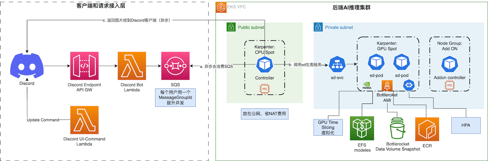

## Gai Gaming Activity

This project is a solution about how to efficiently run a game operation activiy for gamers base on Stable diffusion. We have summarized the following key points:

* A Client that effectively touch your game players. Usually, this client may be a social media, such as Discord  or Fanbook, where a large number of gamers gather. This solution will use Discord as the client for our demonstration.
* Highly elastic backend solution, which can quickly scale to handle high and concurrent requests to generate images from gamers. This solution uses EKS, equipped with components such as EFS, Bottlerocket, nvidia-device-plugin, and Karpenter as the back-end architecture for the demonstration.
* An good stable diffusion checkpoint after fine-tuning, which contains your game style and items in game, and debugs the corresponding inference algorithm.

This is the architecture diagram:

## Security

See [CONTRIBUTING](CONTRIBUTING.md#security-issue-notifications) for more information.

## License

This library is licensed under the MIT-0 License. See the LICENSE file.

